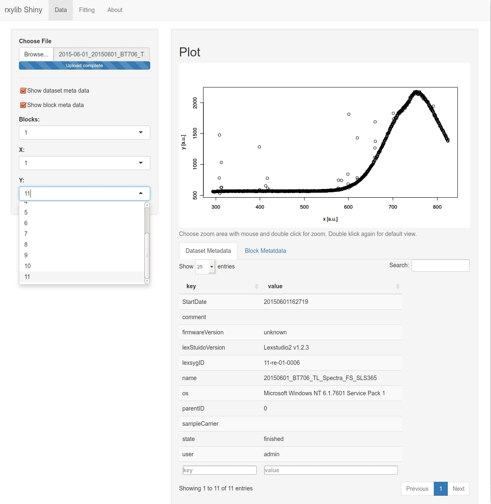
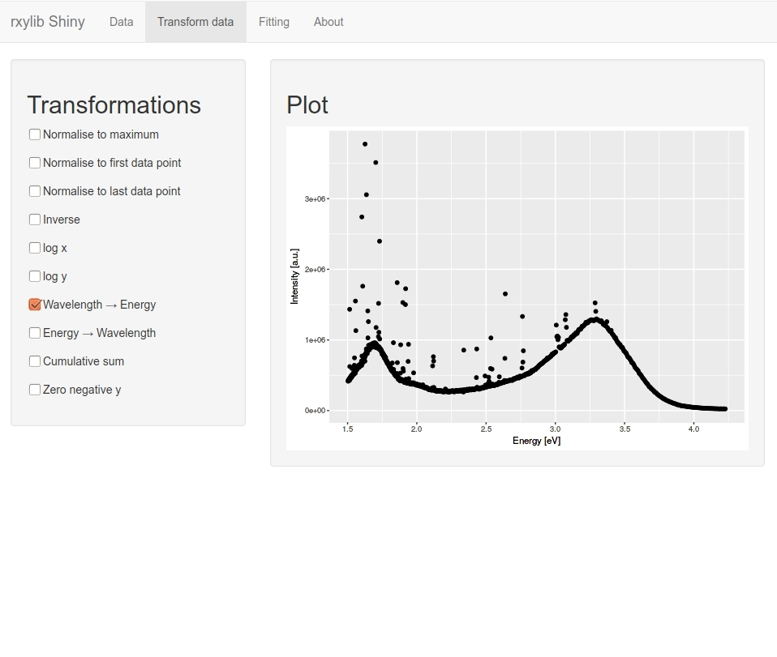

# rxylib Shiny

[](https://travis-ci.org/JohannesFriedrich/rxylibShiny)
[](https://ci.appveyor.com/project/JohannesFriedrich/rxylibshiny)


'rxylib Shiny' is a [Shiny](http://shiny.rstudio.com) app providing a graphical user interface for the **R** package ['rxylib'](https://CRAN.R-project.org/package=rxylib). The app allows visualising x-y data from different file formats. For a complete overview see the ['rxylib'](https://CRAN.R-project.org/package=rxylib) manual.

It is possible to load different file formats and see the x-y plot. Another feature is the transformation of data, e.g. translating wavelength spectra into energy sepctra or normalisations, ...

Until now the plot and transformation panel is fully supported. This is not the case for the fitting feature. This will be extended in the future.

## Impressions

### Online:

[App](https://johnsenfr.shinyapps.io/rxylib_shiny/)

### Data panel:



### Transformation panel:



## Installation and usage

```{r}
if(!require("devtools"))
  install.packages("devtools")
devtools::install_github("JohannesFriedrich/rxylibShiny@master")
```

The application can be run on a local machine with the following command:

```r
rxylibShiny::run_rxylib()
```

## Related projects 

* [xylib](https://github.com/wojdyr/xylib)
* [rxylib](https://github.com/R-Lum/rxylib)
* [fityk](http://fityk.nieto.pl/)

## To Do

* Add fitting functions (on request)
* Add possibility to plot multiple blocks

## License

This program is free software: you can redistribute it and/or modify
it under the terms of the GNU General Public License as published by
the Free Software Foundation, either version 3 of the License, or
any later version.

This program is distributed in the hope that it will be useful,
but WITHOUT ANY WARRANTY; without even the implied warranty of
MERCHANTABILITY or FITNESS FOR A PARTICULAR PURPOSE.  
