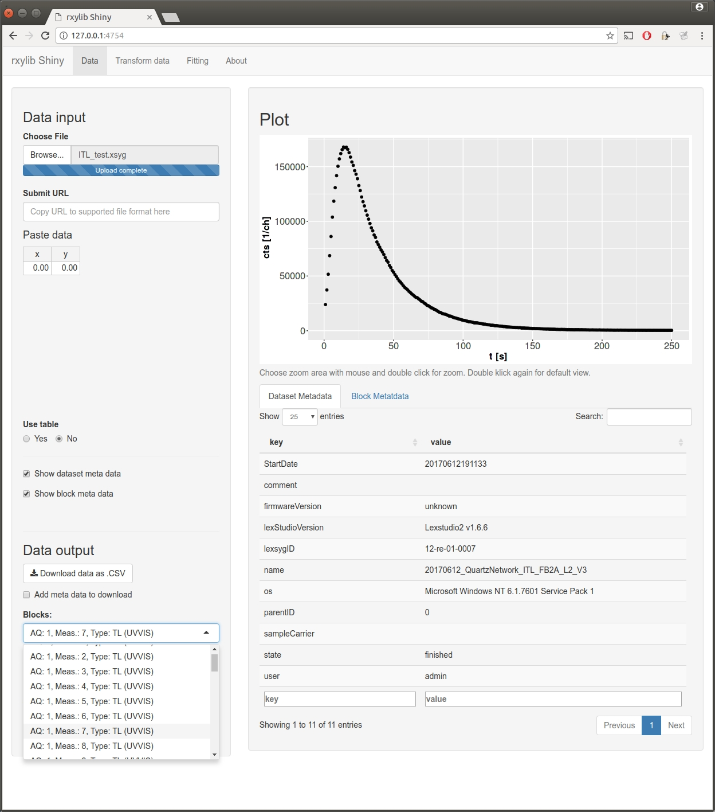
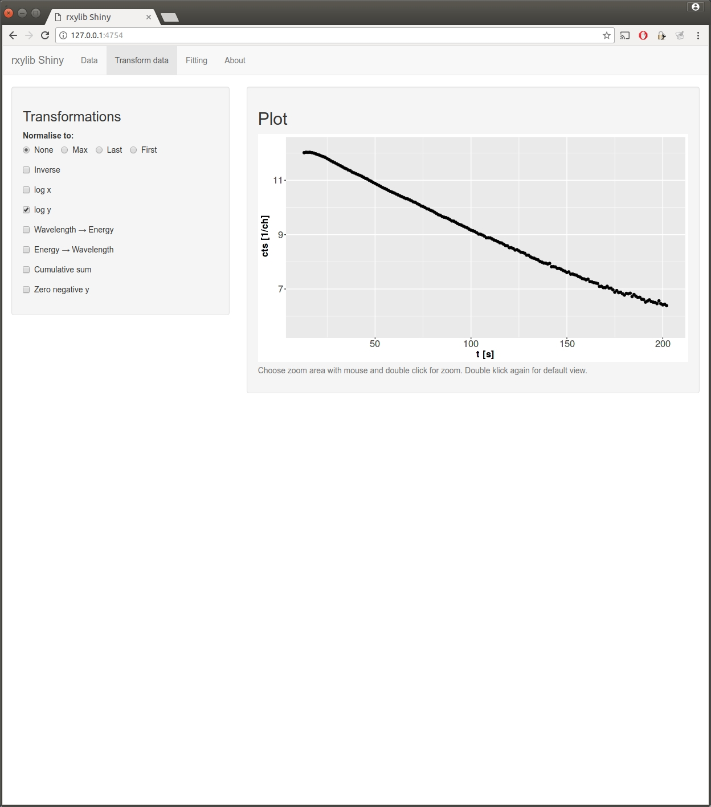
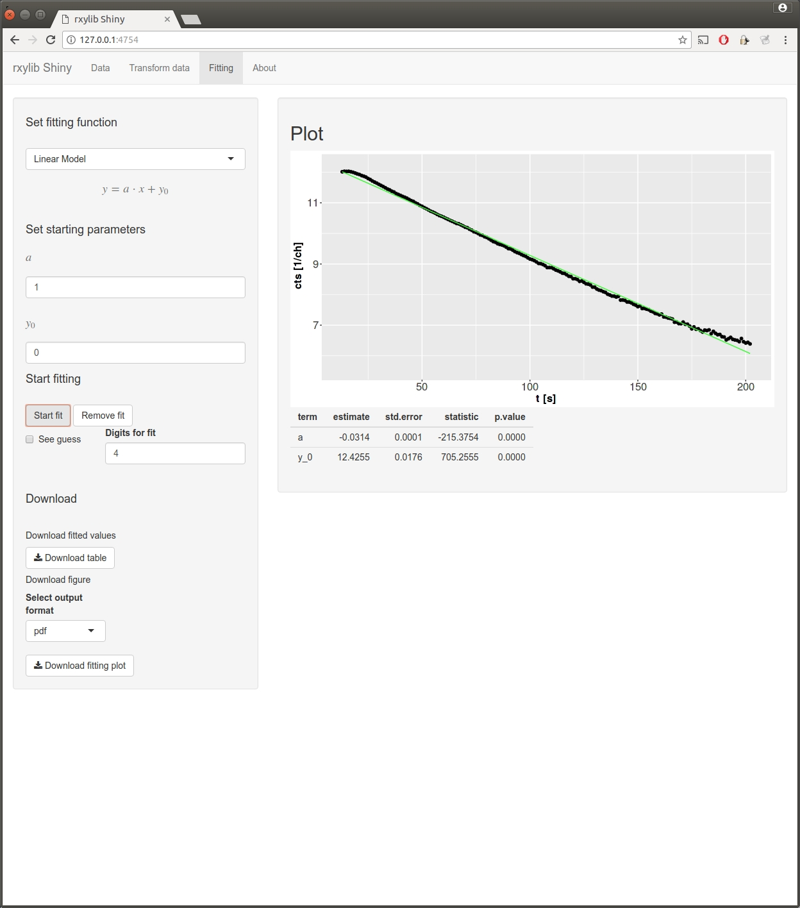

# rxylib Shiny

[](https://travis-ci.org/JohannesFriedrich/rxylibShiny)
[](https://ci.appveyor.com/project/JohannesFriedrich/rxylibshiny)
[](http://www.repostatus.org/#active)

'rxylib Shiny' is a [Shiny](http://shiny.rstudio.com) app providing a graphical user interface for the **R** package ['rxylib'](https://CRAN.R-project.org/package=rxylib). The app allows visualising x-y data from different file formats. For a complete overview see the ['rxylib'](https://CRAN.R-project.org/package=rxylib) manual.

It is possible to load different file formats and see the x-y plot. You can zoom in, investigate details in your data and fit the data.
Another feature is the transformation of data, e.g. translating wavelength spectra into energy sepctra or normalisations, ...

## Some Highlights:

* Interactive plots
* Copy-paste your data into the application
* Build-in transformations
* Fit data to different functions
* Download converted data as *.csv file 
* Download fitted values and figures as pdf, eps, jpeg, ...

## Impressions

### Online:

[Click here to get access to the online version of rxylib Shiny](https://johnsenfr.shinyapps.io/rxylib_shiny/)

### Data panel:



### Transformation panel:



### Fitting panel:




## Installation and usage

```{r}
if(!require("devtools"))
  install.packages("devtools")
devtools::install_github("JohannesFriedrich/rxylibShiny@master")
```

The application can be run on a local machine with the following command:

```r
rxylibShiny::run_rxylib()
```

## Related projects 

* [xylib](https://github.com/wojdyr/xylib)
* [rxylib](https://github.com/R-Lum/rxylib)
* [fityk](http://fityk.nieto.pl/)

## To Do

* Add fitting functions (on request)
* Add possibility to plot multiple blocks

## License

This program is free software: you can redistribute it and/or modify
it under the terms of the GNU General Public License as published by
the Free Software Foundation, either version 3 of the License, or
any later version.

This program is distributed in the hope that it will be useful,
but WITHOUT ANY WARRANTY; without even the implied warranty of
MERCHANTABILITY or FITNESS FOR A PARTICULAR PURPOSE.  
